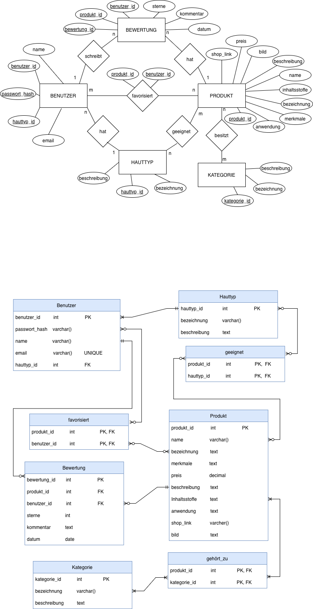

{: .label }
[Tiberja Gündüz]

{: .no_toc }
# Datenmodell

{: .text-delta }

Inhaltsverzeichnis

+ ToC
{: toc }

 

## Beschreibung

Das vorliegende Datenmodell dient der strukturierten Speicherung und Verbindung von Benutzern, Hauttypen und Produkten, um personalisierte Produktempfehlungen zu erhalten und Bewertungen sowie Favoriten zu ermöglichen. Es basiert auf einem Entity-Relationship-Modell und wurde vollständig normalisiert. m:n-Beziehungen werden über Zwischentabellen umgesetzt, Primär- und Fremdschlüssel sorgen dafür, dass die Tabellen korrekt miteinander verbunden sind. Die Struktur unterstützt typische Anwendungsfälle wie Produktbewertungen, Favoritenverwaltung sowie Filterung nach Hauttypen und Kategorien.

### Benutzer 
Die Entität `Benutzer` repräsentiert registrierte Nutzer der Anwendung. Jeder Benutzer besitzt eine eindeutige `benutzer_id` als Primärschlüssel, sowie Angaben wie `Name`, `E-Mail-Adresse` und ein `Passwort-Hash`. Zusätzlich ist jedem Benutzer genau ein Hauttyp zugeordnet (`hauttyp_id`` als Fremdschlüssel).
Ein Benutzer kann:
+ mehrere Produkte favorisieren
+ mehrere Bewertungen verfassen

### Produkt 
Die Entität `Produkt` beschreibt die in der Anwendung verwalteten Produkte. Jedes Produkt wird eindeutig durch `produkt_id` identifiziert und enthält unter anderem Informationen wie `Name`, `Beschreibung`, `Preis`, `Inhaltsstoffe`, `Anwendung`, `Shop-Link` und `Bild`. 
Ein Produkt kann: 
+ von mehreren Benutzern bewertet werden
+ von mehreren Benutzern favorisiert werden
+ mehreren Kategorien angehören
+ für mehrere Hauttypen geeignet sein

### Kategorie 
Zur besseren Strukturierung der Produkte werden Kategorien verwendet. Die Entität `Kategorie` dient dazu, Produkte zu gruppieren (Reinigung, Feuchtigkeit, Sonnencreme, Serum/Booster, Peeling). Ein Produkt kann mehreren Kategorien zugeordnet sein und eine Kategorie kann mehrere Produkte enthalten. Diese m:n Beziehung wird durch die Zwischentabelle `gehört_zu` umgesetzt, welche die Fremdschlüssel `produkt_id` und `kategorie_id` enthält. Durch Kategorien können Produkte übersichtlich organisiert und in der Anwendung gezielt gefiltert werden.

### Hauttyp
Die Entität `Hauttyp` beschreibt verschiedene Hauttypen (Trocken, Ölig, Mischhaut, Sensibel, Normal). Jeder Hauttyp besitzt eine eindeutige `hauttyp_id` sowie eine `Bezeichnung` und `Beschreibung`.
Beziehungen: 
+ Ein Hauttyp kann mehreren Benutzer zugeordnet sein
+ Ein Produkt kann für mehrere Hauttypen geeignet sein
Die m:n Beziehung zwischen `Produkt` und `Hauttyp` wird über die Zwischentabelle `geeignet` abgebildet. 

### Bewertung 
Die Entität `Bewertung` speichert Bewertungen, die Benutzer einem Produkt gegeben haben. Jede Bewertung besitzt eine eindeutige `bewertung_id` und referenziert genau einen Benutzer sowie ein Produkt über Fremdschlüssel (`benutzer_id``, `produkt_id`).
Zusätzlich enthält eine Bewertung: 
+ `Sterneanzahl`
+ `Kommentar`
+ `datum`
Damit entsteht eine 1:n Beziehung zwischen `Benutzer` und `Bewertung` sowie zwischen `Produkt` und `Bewertung`.

### favorisiert 
Die Beziehung `favorisiert` realisiert eine m:n Beziehung zwischen Benutzern und Produkten. Sie wird als eigene Relation mit zusammengesetztem Primärschlüssel (`benutzer_id`, `produkt_id`) umgesetzt und speichert, welche Produkte ein Benutzer als Favorit markiert hat.

### gehört_zu und geeignet
Die Zwischentabellen `gehört_zu` und `geeignet` dienen der Umsetzung von m:n-Beziehungen im relationalen Datenmodell.
+ `gehört_zu` verbindet Produkte mit Kategorien und ermöglicht es, ein Produkt mehreren Kategorien zuzuordnen
+ `geeignet` verbindet Produkte mit Hauttypen und definiert, für welche Hauttypen ein Produkt geeignet ist.
Beide Tabellen bestehen aus den jeweiligen Fremdschlüsseln (`produkt_id`, `kategorie_id` bzw. `hauttyp_id`), die gemeinsam den Primärschlüssel bilden.
