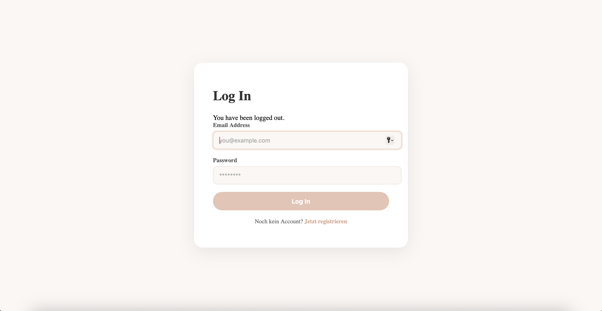
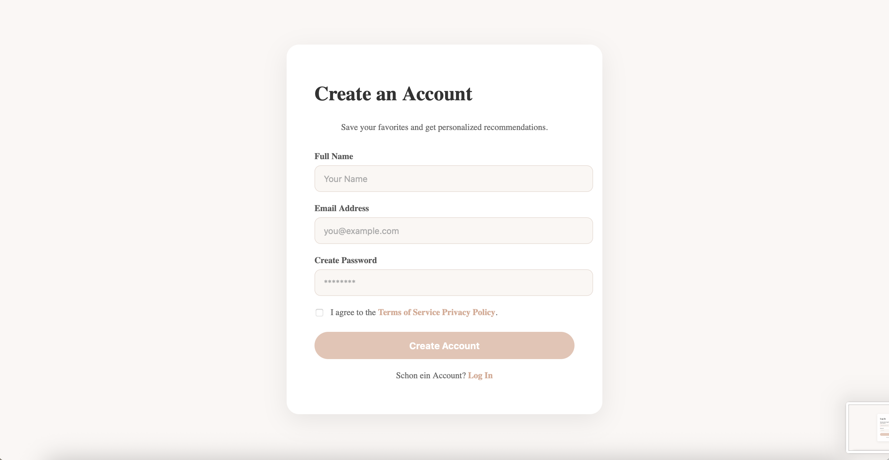
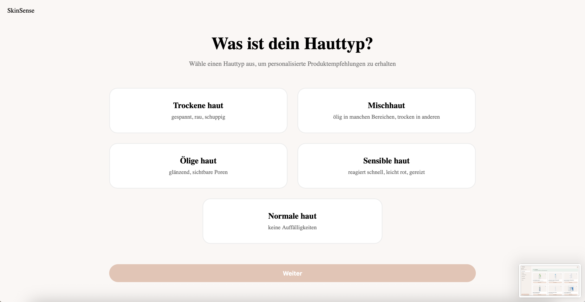
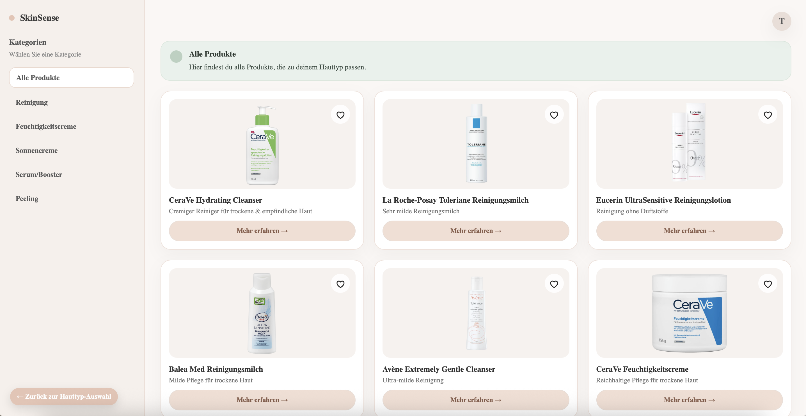
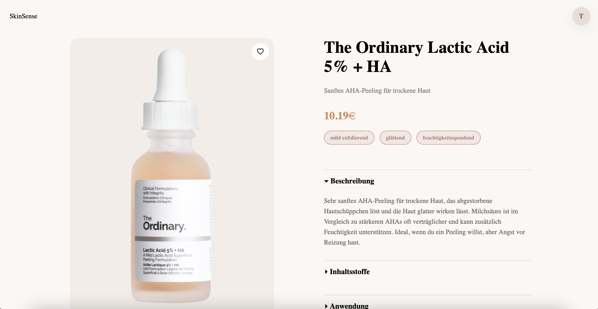
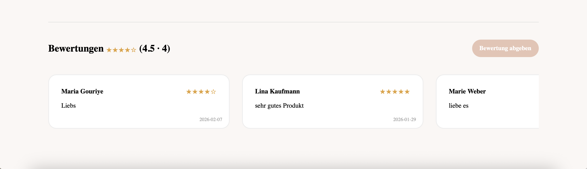

{: .label }
[Tiberja Gündüz]

{: .no_toc }
# Referenzdokumentation

{: .text-delta }

Inhaltsverzeichnis

+ ToC
{: toc }

## Authentifizierung

### `login()`

**Route:** `/login`

**Methode:** `GET` `POST` 

**Zweck:** Zeigt die Login-Seite an und authentifiziert den Benutzer anhand ihrer Zugangsdaten.

**Ausgabe:**

---

### `register()`

**Route:** `/register`

**Methode:** `GET` `POST` 

**Zweck:** Ermöglicht neuen Benutzern die Registrierung eines Accounts.

**Ausgabe:**

---

### `logout()`

**Route:** `/logout`

**Methode:** `GET` 

**Zweck:** Meldet den aktuellen Benutzer ab und beendet die Session.

**Ausgabe:**

Benutzer wird zur Startseite weitergeleitet.

---

## Benutzerseiten

### `index()`

**Route:** `/`

**Methode:** `GET`

**Zweck:** Zeigt die Startseite der Website an und dient als Einstiegspunkt für Benutzer. 

**Ausgabe:**

---

### `skin_type()`

**Route:** `/skin_type`

**Methode:** `GET` `POST`

**Zweck:** Ermöglicht die Auswahl eines Hauttyps, um passende Produkte zu erhalten. 

**Ausgabe:**

---

### `products()`

**Route:** `/products`

**Methode:** `GET` 

**Zweck:** Zeigt eine Liste von Produkten, basierend auf dem ausgewählten Hauttyp.

**Ausgabe:**

---

### `product_details()`

**Route:** `/product_details/<int:product_id>`

**Methode:** `GET` 

**Zweck:** Zeigt Detailinformationen zu einem ausgewählten Produkt, inklusive Bewertungen.

**Ausgabe:**

---

### `favorites()`

**Route:** `/favorites`

**Methode:** `GET` 

**Zweck:** Zeigt eine Übersicht aller vom Benutzer favorisierten Produkte.

**Ausgabe:**

---

## Benutzerinteraktionen

### `toggle_favorite(product_id)`

**Route:** `/favorites/toggle/<int:product_id>`

**Methode:** `POST` 

**Zweck:** Fügt ein Produkt zur Favoritenliste hinzu oder entfernt es davon. 

**Ausgabe:**
Das Herz wird ausgefüllt und das jeweilige Produkt wird in der Favoritenliste angezeigt. 

---

### `add_review(product_id)`

**Route:** `/products/<int:product_id>/reviews`

**Methode:** `POST` 

**Zweck:** Ermöglicht Benutzern eine Bewertung zu einem Produkt hinzuzufügen. 

**Ausgabe:**

---

### `delete_review(product_id, review_id)`

**Route:** `/products/<int:product_id>/reviews/<int:review_id>/delete`

**Methode:** `POST` 

**Zweck:** Ermöglicht Benutzern ihre eigene Bewertung wieder zu löschen. 

**Ausgabe:**

Die ausgewählte Bewertung wird gelöscht und die Seite aktualisiert sich. 

---

## Beispieldaten einfügen

### `run_insert_sample()`

**Route:** `/insert/sample`

**Methode:** `GET`

**Zweck:** Leert die Datenbank und fügt Beispieldaten hinzu. 

**Ausgabe:**

Browser zeigt: `Database flushed and populated with some sample data.`
