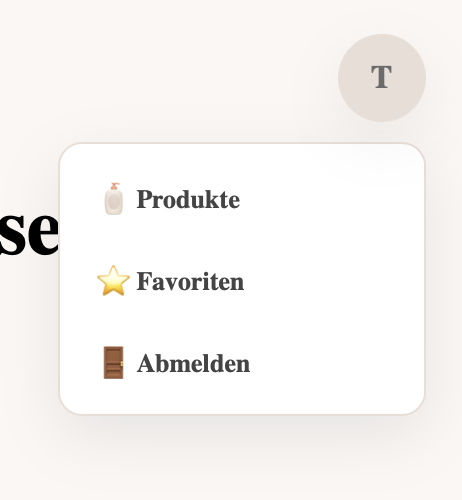
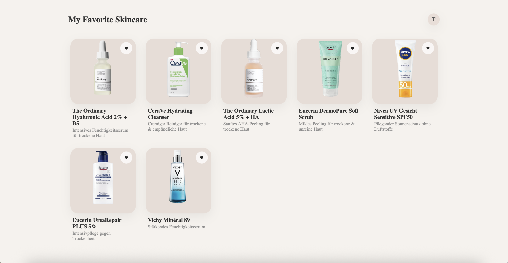

{: .label }
[Acelya Calin]

{: .no_toc }
# Wertversprechen

{: .text-delta }

Inhaltsverzeichnis

+ ToC
{: toc }

## Problemstellung

Viele Menschen, insbesondere junge Nutzer:innen, sind bei der Auswahl geeigneter Hautpflegeprodukte unsicher. Der Markt bietet eine große und unübersichtliche Vielfalt an Produkten, deren Beschreibungen häufig mit Fachbegriffen, komplexen Inhaltsstofflisten und schwer verständlichen Informationen überladen sind. Gleichzeitig fällt es vielen Nutzer:innen schwer, den eigenen Hauttyp richtig einzuschätzen und passende, gut verträgliche Produkte zu identifizieren.
In der Praxis führt diese Unsicherheit dazu, dass Hautpflegeprodukte häufig auf Basis von Werbung, Social-Media-Trends oder Zufall ausgewählt werden. Infolgedessen werden Produkte verwendet, die nicht auf die individuellen Bedürfnisse abgestimmt sind, was Hautprobleme wie Trockenheit, Irritationen oder Unreinheiten verstärken kann.

## Unsere Lösung 

SkinSense bietet eine benutzerfreundliche, verständliche und personalisierte Produktberatung für Hautpflege. Ziel der App ist es, Nutzer:innen dabei zu unterstützen, schnell und sicher Produkte zu finden, die zu ihrem individuellen Hauttyp und ihren persönlichen Anforderungen passen.
Die App ermöglicht:
- personalisierte Produktempfehlungen basierend auf dem Hauttyp
- transparente Informationen zu Inhaltsstoffen in verständlicher Form
- eine übersichtliche Kategorisierung der Produkte (z. B. Reinigung, Feuchtigkeitscreme, Sonnencreme, Serum) 
- eine Favoritenliste zum Speichern und schnellen Wiederfinden passender Produkte
Durch diese Funktionen reduziert SkinSense Unsicherheit beim Kauf, unterstützt informierte Entscheidungen und hilft Nutzer:innen, verträgliche und nachhaltige Hautpflegeprodukte zu finden.

## Zielperson

SkinSense richtet sich insbesondere an folgende Zielgruppen:
- Jugendliche und junge Erwachsene im Alter von ca. 15–25 Jahren
- Personen mit empfindlicher, unreiner oder schwer einschätzbarer Haut
- Nutzer:innen ohne tiefgehendes Fachwissen zu Hautpflege oder Inhaltsstoffen
- Personen, die eine übersichtliche, leicht verständliche und schnelle Produktberatung wünschen
Die App spricht vor allem Menschen an, die sich im Alltag eine einfache, vertrauenswürdige Unterstützung bei der Auswahl von Hautpflegeprodukten wünschen.

## Kundenreise

Einstieg
Nach dem Öffnen von SkinSense erhalten Nutzer:innen eine kurze Einführung, die den Zweck und die grundlegenden Funktionen der App erklärt.
Hauttyp-Abfrage
Über eine einfache Abfrage Informationen zu ihrem Hauttyp an.
Produktempfehlungen
Basierend auf den angegebenen Informationen zeigt die App eine Auswahl von Produkten an, die zum jeweiligen Hauttyp passen. 
Kategoriesortierung
Die empfohlenen Produkte können anschließend nach Kategorien wie Reinigung, Feuchtigkeitscreme, Sonnencreme, Serum oder Peeling sortiert werden. Dadurch wird die Produktauswahl weiter strukturiert und gezielt eingegrenzt.
Produktdetails & Filter
Nutzer:innen haben die Möglichkeit, einzelne Produkte genauer zu betrachten, Inhaltsstoffe nachzuvollziehen 
Favorisieren
Passende Produkte können zur Favoritenliste hinzugefügt werden, um sie später schnell und unkompliziert wiederzufinden.
Abschluss
Am Ende der Nutzung verfügen Nutzer:innen über eine auf ihren Hauttyp abgestimmte Produktauswahl und eine bessere Orientierung für zukünftige Kaufentscheidungen.

## UI Designs 

