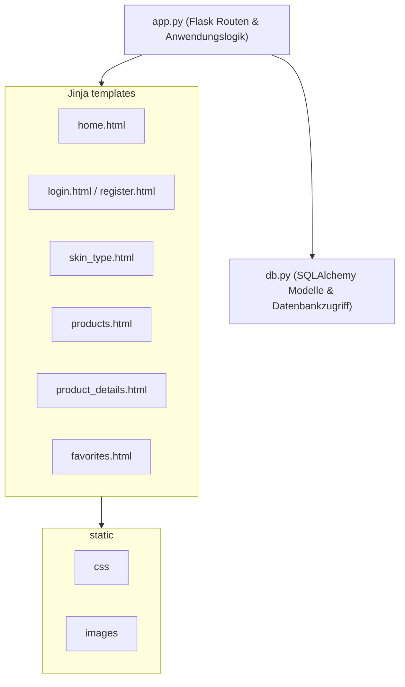

{: .label }
[Tiberja Gündüz]

{: .no_toc }
# Architektur

{: .text-delta }

Inhaltsverzeichnis

+ ToC
{: toc }

## Overview

SkinSense ist eine serverseitig gerenderte Full-Stack-Webanwendung. Sie unterstützt Benutzer dabei, Hautpflegeprodukte zu finden, die zu ihrem Hauttyp passen und hilft ihnen dabei, das Thema Skincare besser zu verstehen und anzuwenden. 

Die Anwendung ist als eine Drei-Ebenen-Architektur aufgebaut und besteht aus Frontend, Backend und Datenbank. Jede dieser Ebenen hat klar definierte Aufgaben und ist logisch von den anderen getrennt, arbeitet aber eng mit ihnen zusammen.

Das Frontend ist mit serverseitig gerenderten Jinja-Templates umgesetzt. Die HTML-Seiten werden vollständig auf dem Server erzeugt und anschließend an den Browser weitergegeben. Inhalte wie Produktlisten, Produktdetails, Benutzerdaten und weitere Informationen werden beim Rendern in die Templates eingebunden. Statische Inhalte wie CSS-Dateien und Bilder sind separat im static-Verzeichnis gespeichert. 

Das Backend basiert auf Flask und bildet die zentrale Steuerung der Anwendung. Es definiert alle Routen, verarbeitet eingehende Anfragen und verwaltet Benutzersitzungen. Zudem übernimmt es die gesamte Anwendungslogik, zum Beispiel die Authentifizierung von Benutzern, das Laden von Produktdaten oder das Erstellen von Bewertungen. Es arbeitet dabei als Vermittler zwischen Datenbank und Frontend. 

Die Datenbank, welche SQLAlchemy nutzt, ist für die Speicherung und Verwaltung aller Daten verantwortlich. Dazu gehören unter anderem Benutzer, Produkte, Kategorien, Bewertungen und Favoriten, sowie deren Beziehung zueinander. Die Datenbank ist zentral aufgebaut, dadurch sind alle Daten strukturiert und gut verwaltbar. 

Der typische Ablauf in SkinSense ist klar strukturiert. Eine Anfrage wird vom Backend entgegengenommen, benötigte Daten werden aus der Datenbank gelesen oder verarbeitet und das Ergebnis wird anschließend als HTML-Seite über das Frontend ausgegeben. Diese bewusst einfache Architektur macht das System übersichtlich und leicht verständlich.

## Codemap

Die Codemap zeigt die grundlegende Struktur von SkinSense und die wichtigsten Codebestandteile. Die zentrale Komponente ist app.py, die alle Flask-Routen sowie die Anwendungslogik enthält. Sie verarbeitet eingehende Anfragen und koordiniert zwischen Datenbank und Templates.

Die Datei db.py bildet die Datenbankschicht. Sie definiert SQLAlchemy-Modelle sowie deren Beziehungen, enthält Beispieldaten und stellt den Zugriff auf Daten bereit. 

Die Jinja-Templates entsprechen jeweils einer Seite der Anwendung, wie zum Beispiel der Startseite, Produktliste oder der Favoritenliste. 

Statische Ressourcen wie Stylesheets und Bilder werden von den Templates eingebunden.

## Cross-cutting concerns

### Session-basierte Authentifizierung und Zugriffskontrolle

SkinSense verwendet eine sessionbasierte Authentifizierung, um den Login-Zustand von Benutzern zu verwalten. Nach erfolgreicher Anmeldung wird die Benutzer-ID in der Session gespeichert und bei Anfragen verwendet, um den aktuellen Benutzer zu identifizieren. Dieser Mechanismus wird an mehreren Stellen genutzt, um zum Beispiel die favorisierten Produkte dem richtigen Benutzer zuzuordnen. Zudem setzen bestimmte Funktionen einen angemeldeten Benutzer voraus. Auf Basis dieses Session-Zustands wird der Zugriff geprüft und nicht eingeloggte Benutzer werden direkt zur Login-Seite weitergeleitet. Weiteres dazu in [design decisions](../design-decisions.md) zu sehen.

### Benutzerabhängige Inhalte

Unsere App basiert darauf benutzerspezifische Inhalte darzustellen. Funktionen wie Produktliste, Favoriten und Bewertungen sind an einen Benutzer gebunden. Das Backend prüft anhand des Session Mechanismus welcher Benutzer aktuell angemeldet ist und lädt oder speichert die zugehörigen Daten in der Datenbank. Dadurch bleiben die Inhalte personalisiert. 

### Zentrale Datenbankschicht in db.py

SkinSense bündelt die gesamte Datenbankschicht in der Datei db.py. Dort befinden sich SQLAlchemy-Konfigurationen, die Datenmodelle sowie deren Beziehungen zueinander. Zusätzlich sind dort auch Beispieldaten hinterlegt. Durch diese zentrale Struktur greifen alle Routen aus app.py auf dieselben Modelle und dieselbe Datenbankanbindung zu. Das sorgt für einen einheitlichen Datenzugriff in der gesamten Anwendung und erleichtert Wartung und Erweiterungen, da Änderungen an Modellen oder Beziehungen an einer Stelle vorgenommen werden können. Weitere Hintergründe zu Wahl von SQLAlchemy sind bei [design decisions](../design-decisions.md) zu finden.
